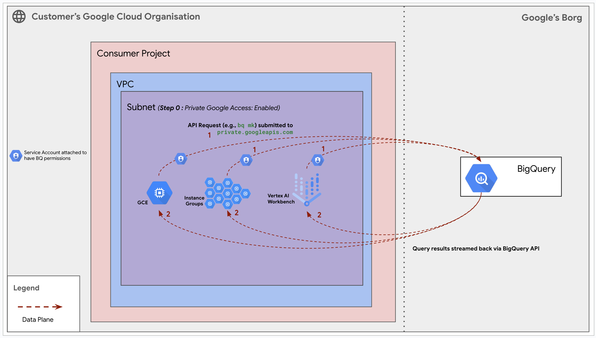
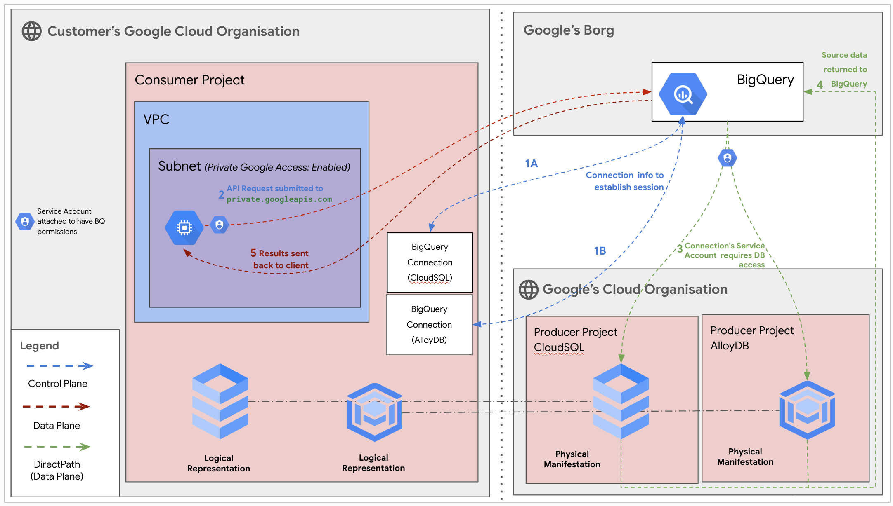

# BigQuery as a Data Producer User Guide

**On this page**

1.  Introduction
2.  Objectives
3.  Architecture
4.  Deploy the Solution
5.  Deploy with "single-click"
6.  Deploy through Terraform-cli
7.  Optional - Delete the Deployment
8.  Troubleshoot Errors
9.  Submit Feedback

---

## Introduction

This document provides a comprehensive guide for deploying and managing Google BigQuery resources using a configuration-driven Terraform module. BigQuery is a fully managed, serverless data warehouse that enables scalable analysis over petabytes of data.

This solution demonstrates two primary architectural patterns:

1.  **BigQuery as a Data Producer:** The standard model where BigQuery acts as a central data warehouse, serving data to private clients within your VPC.
2.  **BigQuery with Federated Queries:** An advanced model where BigQuery queries data in real-time from external databases like Cloud SQL or AlloyDB.

The guide assumes familiarity with Google Cloud Platform (GCP) and Terraform.

## Objectives

This solution guide helps you to:

* Automate the deployment of BigQuery datasets, tables, views, and routines using Terraform.
* Manage your BigQuery resources declaratively using simple YAML configuration files.
* Understand the architecture for securely accessing BigQuery from private networks.
* Provide a foundation for using BigQuery with federated data sources.

## Architecture

This solution supports two key architectures, which can be used independently or together.

### 1. BigQuery as a Data Producer

This design illustrates the standard architecture for securely querying data that resides within BigQuery. Compute resources (like GCE VMs, Instance Groups, or Vertex AI Workbenches) inside a VPC can access the BigQuery API without traversing the public internet by using **Private Google Access**.

<p align="center">
    
</p>

**Request Flow:**

1.  **API Request:** A client with only a private IP address sends a query to BigQuery through the `private.googleapis.com` endpoint. This ensures the request remains within Google's network.
2.  **Query Processing:** BigQuery, running on Google's internal infrastructure, processes the query against its managed storage.
3.  **Results Streamed Back:** The results are streamed back to the client over the same secure, private channel.

### 2. BigQuery with Federated Queries

This design showcases BigQuery acting as a client to query data residing in external databases. This is the architecture for **federated queries**. It uses **BigQuery Connections** to securely connect to Producer Projects hosting databases like CloudSQL and AlloyDB.

<p align="center">
    
</p>

**Request Flow:**

1.  **Federated Query:** A user initiates a query in BigQuery that references an external table.
2.  **Connection:** BigQuery uses the stored **BigQuery Connection** info to establish a session with the target database (e.g., AlloyDB). The connection uses a Service Account with the necessary IAM permissions to access the database.
3.  **External Query & Results:** BigQuery pushes the relevant part of the query down to the source database. The source database runs the query and returns only the necessary data back to BigQuery.
4.  **Final Results:** BigQuery combines the external data with its own (if required) and returns the final result set to the user.

---

## Deploy the Solution

This section provides instructions on deploying the BigQuery producer solution using Terraform.

### Prerequisites

For this configuration, ensure the following are installed:

1.  **Terraform:** This solution is tested with Terraform v1.11.4+. Install from [Terraform Downloads](https://releases.hashicorp.com/terraform/).
2.  **gcloud SDK:** Install the gcloud SDK from [Google Cloud SDK Documentation](https://cloud.google.com/sdk/docs/install) to authenticate to Google Cloud.

### Deploy with "single-click"

This method uses Google Cloud Shell and Cloud Build to automate the deployment.

1.  **Open in Cloud Shell:** Click the button below to clone the repository and open the example configuration files in the Cloud Shell editor.

    <a href="https://ssh.cloud.google.com/cloudshell/editor?shellonly=true&cloudshell_git_repo=https://github.com/0XAbhiX0/cloudnetworking-config-solutions.git&cloudshell_git_branch=main&cloudshell_workspace=.&cloudshell_open_in_editor=configuration/organization.tfvars,configuration/networking.tfvars,configuration/security/gce.tfvars,configuration/producer/BigQuery/config/dataset.yaml.example,configuration/consumer/GCE/config/instance.yaml.example&cloudshell_tutorial=docs/BigQuery/bigquery-producer.md#deploy-with-single-click" target="_new">
    
    </a>

2.  **Run BigQuery Prerequisites Script:**
    This script prepares your Google Cloud project: enables APIs, creates a Terraform state bucket, and sets Cloud Build permissions. From the root of the cloned repository in Cloud Shell, run:

    ```bash
    sh docs/BigQuery/helper-scripts/prereq-bigquery.sh
    ```

    When prompted, enter your Google Cloud Project ID.

3. Update and Rename Configuration Files
    The Cloud Shell editor will open the necessary configuration files. Review each file and update values (project IDs, user IDs/groups, network names, regions, etc.) as per your requirements. Follow the guidance in the "Deploy through Terraform-cli" section of this document for details on each file

    * **`configuration/organization.tfvars`**
    * **`configuration/networking.tfvars`**
    * **`configuration/security/gce.tfvars`**
    * **`configuration/producer/BigQuery/config/dataset.yaml.example`** (Rename to `dataset.yaml` after updating.)
    * **`configuration/consumer/GCE/config/instance.yaml.example`** (Rename to `instance.yaml` after updating.)

4.  **Submit Cloud Build Job to Deploy BigQuery:**
    Once configurations are updated and prerequisites are met, submit the Cloud Build job. Ensure you are in the root of the cloned repository.

    ```bash
    gcloud builds submit . --config docs/BigQuery/build/cloudbuild-bigquery.yaml
    ```

5.  **Verify Deployment:**
    After the Cloud Build job completes, go to the **BigQuery** page in the Google Cloud Console. Confirm that your new dataset(s) and any nested tables or views have been created successfully.

### Optional - Delete the Deployment using Cloud Build

To remove all resources created by this deployment, run the destroy Cloud Build job:

```bash
gcloud builds submit . --config docs/BigQuery/build/cloudbuild-bigquery-destroy.yaml
```

### Deploy through Terraform-cli

This method is for users who prefer to run Terraform commands manually. It provides granular control over the deployment process.

1.  **Clone the Repository:**
    ```bash
    git clone https://github.com/GoogleCloudPlatform/cloudnetworking-config-solutions.git
    cd cloudnetworking-config-solutions
    ```

2.  **Update Configuration Files:**
    Navigate to the `configuration` directory and update the configuration files for each stage.

    * **00-bootstrap stage**

        * Update `configuration/bootstrap.tfvars` - update the Google Cloud project IDs and the user IDs/groups in the tfvars.

    * **01-organisation stage**
        Update `configuration/organization.tfvars`. Set your `project_id` and ensure the necessary APIs for this solution are uncommented.
        ```
        activate_api_identities = {
        "project-01" = {
            project_id = "<your-project-id>" # <-- UPDATE THIS
            activate_apis = [
            "iam.googleapis.com",
            "compute.googleapis.com",
            "cloudbuild.googleapis.com",
            "cloudresourcemanager.googleapis.com",
            "bigquery.googleapis.com",
            "bigqueryconnection.googleapis.com"
            ],
          },
        }
        ```

    * **02-networking stage**
        Update `configuration/networking/networking.tfvars`. Define your VPC and the subnet where the consumer VM will live. **Crucially, set `enable_private_access = true`** to allow the VM to reach Google APIs.
        ```
        project_id   = "<your-project-id>" # <-- UPDATE THIS
        region       = "us-central1"   # <-- UPDATE THIS

        ## VPC input variables
        network_name = "bq-consumer-vpc" # <-- UPDATE THIS
        subnets = [
        {
          name                  = "bq-consumer-subnet" # <-- UPDATE THIS
          ip_cidr_range         = "10.10.10.0/24"      # <-- UPDATE THIS
          region                = "us-central1"        # <-- UPDATE THIS
          enable_private_access = true                 # REQUIRED for private BQ access
        }
        ]
        shared_vpc_host = false
        # PSC/Service Connecitvity Variables

        create_scp_policy      = false # Use true or false based on your requirements
        subnets_for_scp_policy = [""]  # List subnets here from the same region as the SCP

        ## Cloud Nat input variables
        create_nat = false # Use true or false 

        ## Cloud HA VPN input variables

        create_havpn = false
        peer_gateways = {
        default = {
          gcp = "" # e.g. projects/<google-cloud-peer-projectid>/regions/<google-cloud-region>/vpnGateways/<peer-vpn-name>
        }
        }

        tunnel_1_router_bgp_session_range = ""
        tunnel_1_bgp_peer_asn             = 64514
        tunnel_1_bgp_peer_ip_address      = ""
        tunnel_1_shared_secret            = ""

        tunnel_2_router_bgp_session_range = ""
        tunnel_2_bgp_peer_asn             = 64514
        tunnel_2_bgp_peer_ip_address      = ""
        tunnel_2_shared_secret            = ""

        ## Cloud Interconnect input variables

        create_interconnect = false # Use true or false
        ```
    * **03-security stage(GCE Security)**
        Update `configuration/security/gce.tfvars` to define firewall rules for your VPC. This example allows secure SSH access via IAP.
        ```
        project_id = "<your-project-id>" # <-- UPDATE THIS
        network    = "bq-consumer-vpc" # <-- Must match the network_name from the 02-networking stage

        ingress_rules = {
        # The rule name is now the "key" of the map entry
        "allow-ssh-from-iap" = {
          description = "Allow SSH access from Google's Identity-Aware Proxy service"
          priority    = 1000
          source_ranges = [
          "35.235.240.0/20", # Google IAP IP Range
          ]
          target_tags = ["allow-ssh-iap"]
          allow = [{
          protocol = "tcp"
          ports    = ["22"]
          }]
        },
        
        "allow-internal-vpc-traffic" = {
          description = "Allow all traffic from within the VPC network"
          priority    = 1000
          source_ranges = [
          "10.10.10.0/24", # <-- UPDATE THIS to match your VPC's subnet range
          ]
          # No target_tags means this rule applies to all instances in the network
          target_tags = []
          allow = [{
          protocol = "all"
          ports    = []
          }]
        }
        }
        ```

    * **03-security stage(Google Managed SSL Certificates)**
        Update `configuration/security/Certificates/Compute-SSL-Certs/Google-Managed/google_managed_ssl.tfvars` - update the google cloud project ID in the google_managed_ssl.tfvars.
        ```
        project_id           = "<producer-project-id>"
        ssl_certificate_name = "my-managed-ssl-cert"
        ssl_managed_domains = [
        {
          domains = ["example.com", "www.example.com"]
        }
        ]
        ```

    * **04-producer stage(Big Query)**
        Create a new file `configuration/producer/BigQuery/config/bigquery.yaml` from the provided example. Update it with your dataset details.
        ```yaml
        project_id: <your-project-id>
        dataset_id: "data_reports"
        dataset_name: "Data Reports"
        description: "Confidential dataset for analysis"
        location: US

        access:
          - role: roles/bigquery.dataViewer
            group_by_email: <data-viewers@your-company.com>
          - role: roles/bigquery.dataOwner
            user_by_email: <data-owner@your-company.com>

        tables:
          - table_id: "financial_reports"
            description: "Table containing financial data."
            deletion_protection: false
            schema: >
              [
                {
                "name": "report_id", "type": "STRING", "mode": "REQUIRED"
                },
                {
                "name": "quarter", "type": "STRING", "mode": "NULLABLE"
                }
              ]
        ```

    * **05-producer-connectivity stage**
        For this user journey we do not need to create any psc connections hence go to `configuration/producer-connectivity.tfvars` and update the contents of producer-connectivity.tfvars file to look like this.
        ```
        psc_endpoints = []
        ```

    * **06-consumer stage(GCE)**
        Create a new file `configuration/consumer/GCE/config/instance.yaml`. This defines the GCE instance that will be used to test connectivity to BigQuery.
        ```yaml
        name: bq-client-vm
        project_id: <your-project-id>
        region: us-central1
        zone: us-central1-a
        image: ubuntu-os-cloud/ubuntu-2204-lts
        network: projects/<your-project-id>/global/networks/bq-consumer-vpc
        subnetwork: projects/<your-project-id>/regions/us-central1/subnetworks/bq-consumer-subnet
        ```
3.  **Execute Terraform Stages:**
    You can deploy the stages individually using `run.sh` or deploy all stages automatically. Navigate to the `execution/` directory and run:

    ```bash
    ./run.sh -s all -t init-apply-auto-approve
    ```

    **or**

    ```bash
    ./run.sh --stage all --tfcommand init-apply-auto-approve
    ```

4.  **Verify Deployment:**
    Once deployment is complete, in the Google Cloud Console, check that the **VPC**, **GCE instance**(VM), and **BigQuery dataset** have been created. You can test connectivity from another VM within the same VPC.

## Troubleshoot Errors

* **Permission Denied Errors:** Ensure the `prereq-bigquery.sh` script completed successfully and that the Cloud Build Service Account has the required IAM roles (`roles/bigquery.admin`, `roles/storage.admin`).
* **YAML Parsing Errors:** The Terraform module uses `yamldecode`. Ensure your `.yaml` files have valid syntax.
* **Resource Not Found:** Double-check that you have renamed your `.yaml.example` files to `.yaml`. The module will not find files with the `.example` suffix.

---

### Submit feedback

For common troubleshooting steps and solutions, please refer to the **[troubleshooting.md](../troubleshooting.md)** guide.

To provide feedback, please follow the instructions in our **[submit-feedback.md](../submit-feedback.md)** guide.